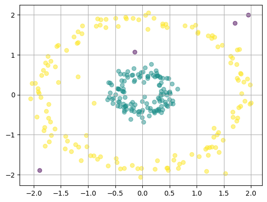

# Robust_Convex_Clustering_with_Median_of_Means
Codes for the paper "Convex Clustering Redefined: Robust Learning with the Median of Means Estimator".

Instructions: 
#1. The folder "real_testing" contains codes for algorithms to be run on real datasets. They include the links to the real datasets. They output a file that contains a sequence of ARI, AMI, and the estimated number of clusters for the dataset. These are useful for various tests and error rates provided in the main paper and the appendix. Below are some code blocks that you need to keep in mind while running the code:

```python
## This is an illustration of the comet_testing.ipynb file with additional comments
dataset = "newthyroid" ## choose the dataset name here
```
```python
## Choose the set of hyperparameters you prefer
n, d = data.shape ## n = number of datapoints, d = dimension of data
p = 0.1 ## noise % in fraction
gamma = 50000 ## gamma parameter defined in the algorithm
mu = 100 ## mu parameter defined in the algorithm
k = 45 ## nearest neighbours parameter in k-NN
phi = 0.01 
l = n // 20 ## Number of bins
b = n // l ## Number of elements in a bin
N = 100 ## Number of iterations
tol1 = 0.02 ## Tolerance parameter defined in the algorithm
tol2 = 0.5 ## Tolerance parameter defined in the algorithm

t = np.arange(n)
```
```python
## Here, you can set the desired directory where you want to save the output.
## The output is saved as dataset.csv (in this case, newthyroid.csv)
file = open(dataset + ".csv", "a")
csvwriter = csv.writer(file)
for m in range(m):
    csvwriter.writerow([k_star[m], ari[m], nnmi[m]])
file.close()
```
This is how the output looks like:
```
k*,ari,nnmi
4,0.979428490191042,0.9204397662192251
4,0.9761196880837723,0.9118458794392409
4,0.9667183481830429,0.8879166706405104
4,0.9761196880837723,0.9118458794392409
4,0.9761196880837723,0.9118458794392409
4,0.9738558996587799,0.9053236443706584
4,0.9761196880837723,0.9118458794392409
5,0.9614211875735842,0.8648203280209935
4,0.9665433866026978,0.8870909574317797
4,0.9736821659514047,0.9060605455713794
4,0.9713315357349245,0.8992758407775359
5,0.962900257377943,0.8693911188978068
4,0.9667183481830429,0.8879166706405104
4,0.9532065217783168,0.8831960884636375

```

#2.  The folder "synthetic_testing" contains codes for algorithms to be run on real datasets. They include the functions to form the synthetic datasets. 
Below are some code blocks that you need to keep in mind while running the code:
```python
## Choose the set of hyperparameters you prefer
gamma = 50000 ## gamma parameter defined in the algorithm
mu = 3 ## mu parameter defined in the algorithm
k = 13 ## nearest neighbours parameter in k-NN
phi = 0.01
N = 500 ## Number of iterations
tol1 = 0.005 ## Tolerance parameter defined in the algorithm
tol2 = 0.5 ## Tolerance parameter defined in the algorithm
```
```python
## Uncomment the line corresponsing to the dataset you want to work on
# data, label = skd.make_blobs(n_samples = 500, random_state = 100) # tol1 = 0.01
data, label = skd.make_circles(n_samples = 250, factor = 0.25, noise = 0.05, random_state = 0) 
```
This is how the output looks like:
```
Noise : 0.0
Iterations : 1 2 3 4 5 6 7 8 9 10 11 12 13 14 15 
Number of clusters : 2.0 +/- 0.0
ARI : 1.0 +/- 0.0
NNMI : 1.0 +/- 0.0

Noise : 0.05
Iterations : 1 2 3 4 5 6 7 8 9 10 11 12 13 14 15 
Number of clusters : 2.0 +/- 0.0
ARI : 1.0 +/- 0.0
NNMI : 1.0 +/- 0.0

Noise : 0.1
Iterations : 1 2 3 4 5 6 7 8 9 10 11 12 13 14 15 
Number of clusters : 2.1333333333333333 +/- 0.33993463423951903
ARI : 0.9932291223698614 +/- 0.02328923700992348
NNMI : 0.991689170957223 +/- 0.02696855321910278

Noise : 0.15000000000000002
Iterations : 1 2 3 4 5 6 7 8 9 10 11 12 13 14 15 
Number of clusters : 1.8 +/- 0.5416025603090641
ARI : 0.7260269891064441 +/- 0.4384136444601985
NNMI : 0.7238830535931603 +/- 0.43735554102152124

Noise : 0.2
Iterations : 1 2 3 4 5 6 7 8 9 10 11 12 13 14 15 
Number of clusters : 1.9333333333333333 +/- 0.8537498983243799
ARI : 0.6192049595333597 +/- 0.44749199523473543
NNMI : 0.6251327343476533 +/- 0.4493159700250917


```

